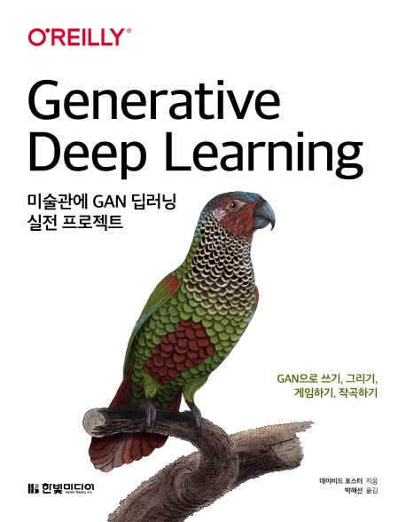

# 미술관에 GAN 딥러닝(Generative Deep Learning)
### GAN으로 쓰기, 그리기, 게임하기, 작곡하기

한빛미디어에서 출간한 "미술관에 GAN 딥러닝" 책의 코드 저장소입니다. ([교보문고](http://www.kyobobook.co.kr/product/detailViewKor.laf?ejkGb=KOR&mallGb=KOR&barcode=9791162241080&orderClick=LOA&Kc=#N), [Yes24](http://www.yes24.com/Product/Goods/81538614))

**책을 구매하시면 꼭 [에러타 페이지](http://bit.ly/gdl-book)를 확인해 주세요.**

## 저장소 구성

이 저장소는 다음과 같이 구성되어 있습니다.

각 장의 노트북은 저장소의 루트 폴더에 있습니다. 노트북 파일 이름은 장의 번호로 시작합니다.

`data`는 관련 데이터가 다운로드되는 폴더입니다(3장 부터)
`run`는 생성 모델의 출력이 저장되는 폴더입니다(3장 부터)
`utils`는 노트북에서 사용되는 유틸리티 함수가 저장되어 있는 폴더입니다.

## 목차
1부: 생성 딥러닝을 소개합니다
* 1장: 셍성 모델링
* 2장: 딥러닝
* 3장: VAE - 변이형 오토인코더
* 4장: GAN - 생성적 적대 신경망

2부: 컴퓨터에게 그리기, 글쓰기, 작곡하기, 게임을 가르칩니다
* 5장: 그리기
* 6장: 쓰기
* 7장: 작곡하기
* 8장: 게임하기
* 9장: 생성 모델링의 미래
* 10장: 결론

## 시작하기

주피터 노트북을 실행하려면 먼저 다음 명령으로 파이썬 가상 환경(virtual environment) 안에 필요한 라이브러리를 설치하세요.

`pip install -r requirements.txt`
 

